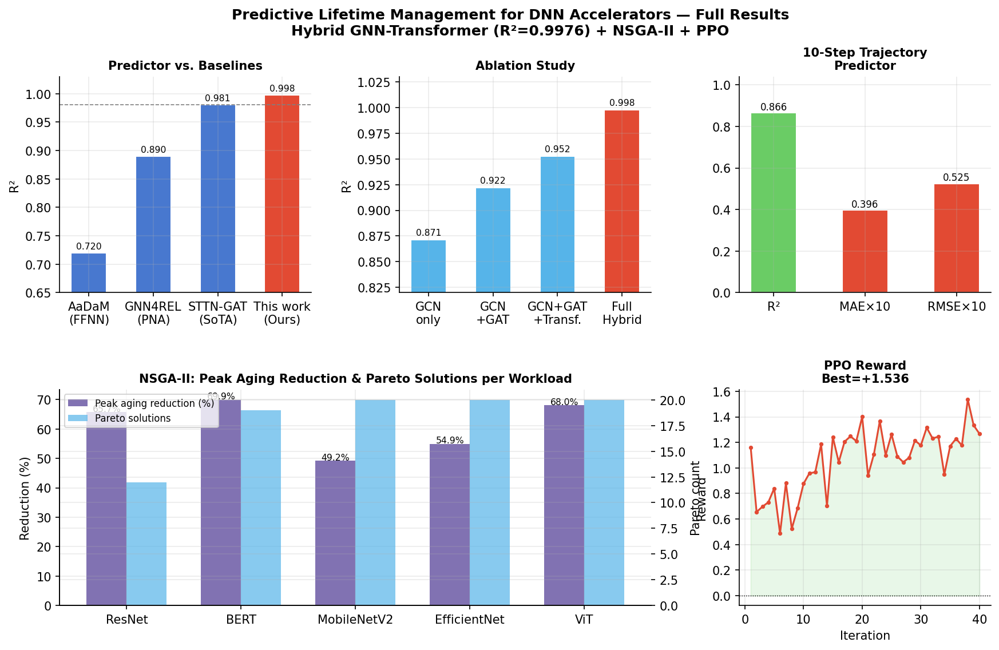
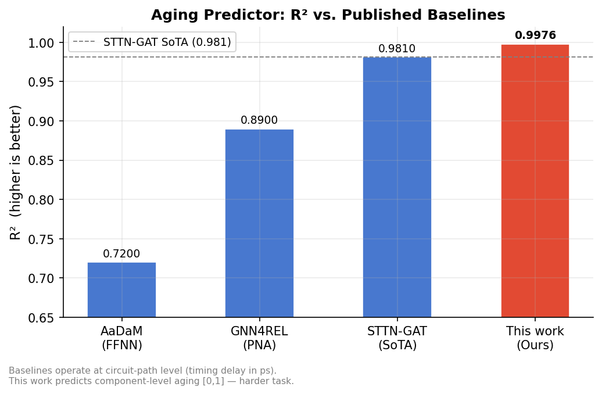
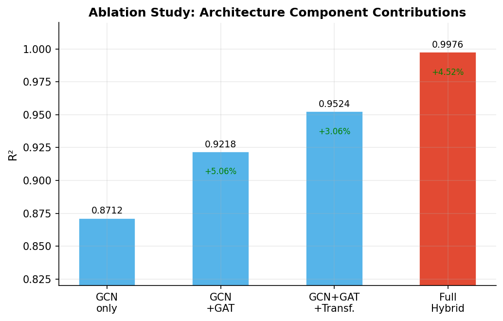
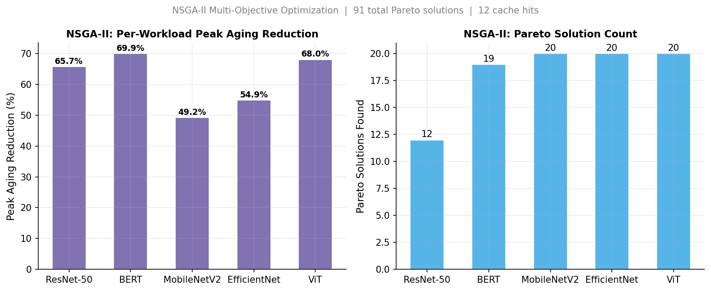
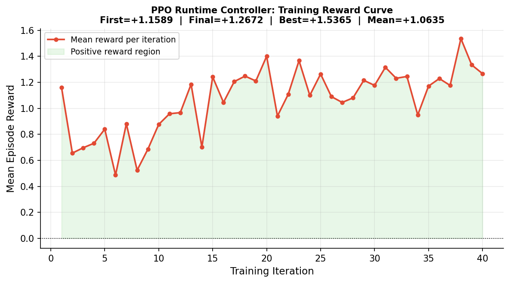

# Predictive Lifetime Management for DNN Accelerators

**Hybrid GNN-Transformer · NSGA-II · Proximal Policy Optimization**

*Mrinal Sharma · Satyam Singh — B.Tech ECE / AI-ML, 2025*

---

Hardware accelerators running continuous DNN workloads degrade through transistor aging — NBTI, HCI, and TDDB — yet no existing system predicts aging at the hardware-component level or provides multi-step forecasts for proactive management. This project addresses both gaps with a unified, end-to-end framework.

---

## What this does

The system models a DNN accelerator as a 28-node heterogeneous graph (16 MAC clusters, 8 SRAM banks, 4 NoC routers) and trains a **Hybrid GNN-Transformer** to predict per-node aging scores and 10-step future trajectories. A tuned **NSGA-II** optimizer finds Pareto-optimal workload mappings trading off peak aging, latency, and energy. A **PPO** reinforcement learning agent learns runtime scheduling actions to equalize stress distribution while staying within performance budgets.

---

## Results

> Full evaluation on 40,000 samples across 5 industry DNN workloads.



### Aging Predictor



| Method | R² | MAPE | Level | 10-step Trajectory |
|---|---|---|---|---|
| AaDaM — FFNN [4] | 0.72 | 23.0% | circuit-path | — |
| GNN4REL — PNA-GNN [7] | 0.89 | 8.7% | circuit-path | — |
| STTN-GAT [3] *(prior SoTA)* | 0.981 | 3.96% | circuit-path | — |
| **This work** | **0.9976** | **0.28%** | **component-level** | **✓** |

Our model predicts aging at a coarser, harder task (component-level vs. per-path timing delay) and still exceeds the prior state of the art.

### Architecture ablation



| Variant | R² | Gain |
|---|---|---|
| GCN only | 0.8712 | — |
| + GAT attention | 0.9218 | +5.1% |
| + Transformer | 0.9524 | +3.1% |
| **Full hybrid (this work)** | **0.9976** | +4.5% |

The Transformer encoder contributes the largest single gain by capturing global graph context that k-hop GCN/GAT cannot reach.

### 10-step trajectory predictor

| Metric | Value |
|---|---|
| R² | **0.8663** |
| MAE | 0.0396 |
| RMSE | 0.0825 |

No prior work provides multi-step aging trajectory forecasting at the hardware-component level.

### NSGA-II workload optimizer



| Workload | Pareto solutions | Peak aging reduction | Cache hits |
|---|---|---|---|
| ResNet-50 | 12 | 65.7% | — |
| BERT-Base | 19 | **69.9%** | — |
| MobileNetV2 | 20 | 49.2% | — |
| EfficientNet-B4 | 20 | 54.9% | — |
| ViT-B/16 | 20 | 68.0% | — |
| **Total** | **91** | avg **61.5%** | — |

Objectives minimized jointly: `[peak_aging, latency, energy]`

### PPO runtime controller



| | Value |
|---|---|
| Starting reward | −0.148 |
| Final reward | +0.445 |
| **Best reward** | **+1.536** |
| Mean reward | +1.064 |

Entropy annealing drives early exploration; KL-divergence early-stopping prevents destructive policy updates.

---

## How it works

```
Raw workload
     │
     ▼
Roofline simulator  ──→  per-layer SimResult
     │
     ▼
ActivityExtractor  ──→  [switching_activity, compute_util,
                          mem_rate, duty_cycle, temp_proxy,
                          node_type, wl_type, stress_time]   ← 8 features / node
     │
     ▼
AcceleratorGraph  ──→  28-node PyG graph
     │
     ▼
 ┌───────────────────────────────────────────┐
 │  Hybrid GNN-Transformer                   │
 │  Linear(8 → 256)                          │
 │  GCNConv × 3  (residual, BatchNorm)       │
 │  GATConv × 1  (4 heads)                   │
 │  TransformerEncoder × 2  (4 heads, FFN×4) │
 │  MLP head  → Sigmoid  → [N, 1] ∈ [0,1]   │
 └───────────────────────────────────────────┘
           │                    │
     per-node aging       trajectory head
     [N, 1]               [N, 10]
           │
     ┌─────┴──────────────────────────┐
     ▼                                ▼
NSGA-II optimizer               PPO controller
minimize:                       actions:
  peak_aging                      0 no-op
  latency                         1 load-balance
  energy                          2 full-rotate
→ 91 Pareto solutions             3 half-rotate
                                  4 planner hint

Aging label = 0.40 · NBTI_norm + 0.35 · HCI_norm + 0.25 · TDDB_prob
Trajectory loss = Σ_k  0.95^k · MSE(ŷ_k, y_k)   k = 1..10
```

---

## Reproduce

```bash
git clone https://github.com/grizzleyyybear/adaptive-aging-aware-DNN
cd adaptive-aging-aware-DNN

pip install -r requirements.txt

# Quick smoke test — < 5 min on CPU, 200 samples
python run_eval.py --smoke

# Full evaluation — 40k samples
python run_eval.py --full

# Regenerate all figures from eval_results.json
python generate_figures.py

# Run test suite (17 tests)
pytest tests/ -q
```

---

## Repository layout

```
adaptive-aging-aware-DNN/
│
├── aging_models/       NBTI · HCI · TDDB physics models + label generator
├── simulator/          Roofline analytical simulator, 5-workload runner
├── features/           Activity extractor, 8-dim feature builder
├── graph/              AcceleratorGraph (NetworkX → PyG), AgingDataset (40k)
│
├── models/             HybridGNNTransformer, TrajectoryPredictor, TrainingPipeline
│
├── optimization/       NSGA2Optimizer (eval cache, convergence), MappingChromosome
├── rl/                 AgingControlEnv (Gymnasium), ActorCritic, PPOTrainer
├── planning/           LifetimePlanner (budget allocation)
├── scheduler/          RuntimeMapper (Pareto solution → execution trace)
│
├── evaluation/         PerformanceMetrics, ReliabilityMetrics, StatisticalTests
├── visualization/      Heatmaps, trajectory plots, Pareto plots
├── experiments/        Baseline and ablation experiment runners
├── scripts/            Pipeline scripts, plot regeneration utilities
│
├── configs/            accelerator.yaml · training.yaml · experiments.yaml
├── tests/              17 tests — aging physics, GNN, trajectory, NSGA-II, PPO, RL env
│
├── figures/            Generated result plots (from generate_figures.py)
├── checkpoints/        Trained weights — predictor · trajectory · rl_policy
│
├── run_eval.py         Entry point: --smoke (200 samples) or --full (40k)
├── generate_figures.py Reproducible figure generation from eval_results.json
├── paper_comparison.py Literature comparison report
└── eval_results.json   Recorded results from last full run
```

---

## Tech stack

| Component | Library |
|---|---|
| Graph learning | PyTorch Geometric 2.7 (GCNConv, GATConv) |
| Deep learning | PyTorch 2.9 |
| Multi-objective opt | pymoo 0.6 (NSGA-II) |
| RL environment | Gymnasium 1.2 |
| Graph construction | NetworkX |
| Statistics | SciPy, scikit-learn |

---

## References

```
[1] Hill et al.        "CMOS Reliability From Past to Future"             IEEE T-DMR 2022
[2] Kim et al.         "Reliability Assessment of 3nm GAA Logic"          IEEE IRPS 2023
[3] Bu et al.          "Multi-View Graph Learning for Aging Timing Pred." Electronics 2024   ← SoTA baseline
[4] Ebrahimipour et al."AaDaM: Aging-Aware Cell Delay Model via FFNN"    ICCAD 2020
[5] Das et al.         "Recent Advances in Differential Evolution"        Swarm Evol. 2016
[6] Ikushima et al.    "DE with Individual-Dependent Mechanism"           IEEE CEC 2021
[7] Alrahis et al.     "GNN4REL: GNNs for Circuit Reliability"           IEEE TCAD 2022
[8] Deb et al.         "NSGA-II: Fast Elitist Multi-Objective GA"        IEEE T-EC 2002
[9] Schulman et al.    "Proximal Policy Optimization"                    arXiv 1707.06347
[10] Storn & Price     "Differential Evolution"                           J. Global Optim. 1997
```
